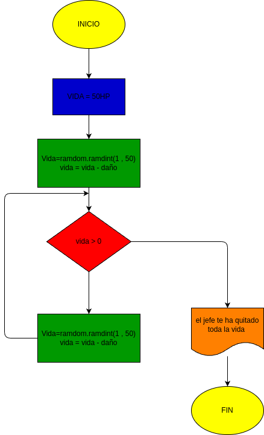

# EJERCICIO 2
Ejercicio No. 2: Situación: Tu personaje tiene 50 puntos de vida (HP). En cada turno, el jefe te quita una cantidad aleatoria de vida. Si tu vida baja de 0, pierdes.  Para este ejercicio consulte y haga uso de la instrucción break.

# diagrama de flujo

GRACIAS
