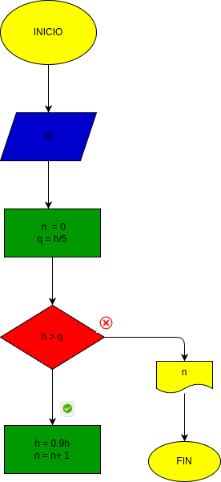

# ejercicio 4 

4. Una pelota se deja caer desde una altura h, y en cada rebote sube el 10% menos del anterior.  Hacer el diagrama de flujo y el programa en Python, que lea h, y que calcule e imprima en cuál rebote la pelota no alcanza a subir la quinta parte de la altura inicial.

# diagrama de flujo

GRACIAS